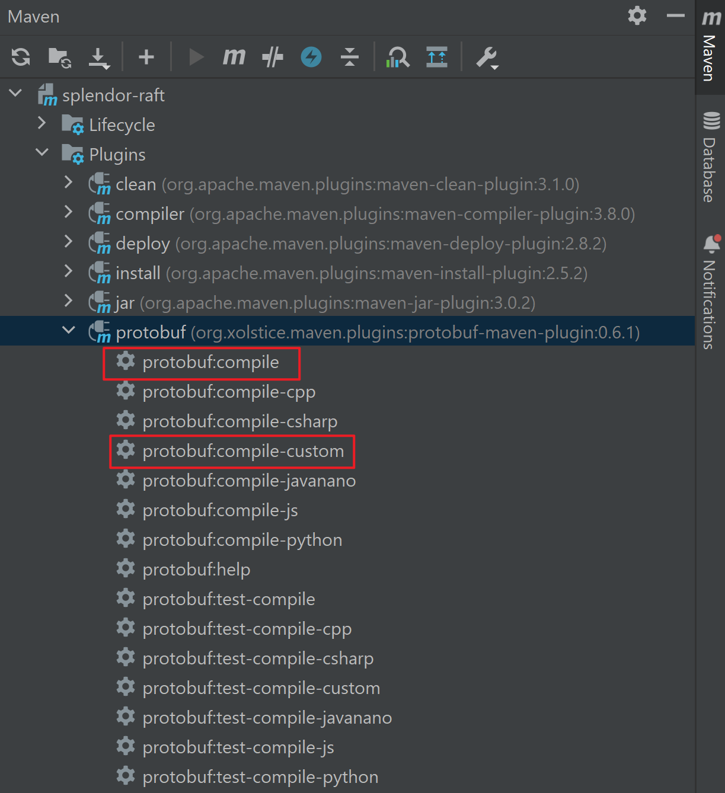

# Splendor-RAFT

## COMP90020 Group Project

Splendor-RAFT is a distributed key-value service using Raft as the underling consensus algorithm between multiple servers.

### Project Structure                 

    ├── docs                              # Documentation
    ├── src                               # Source code 
        └── main
            └── java
                └── com
                    └── da
                        ├── entity        # Message protocols
                        ├── executor      # Task executors
                        ├── kv            # Key-Value service
                            ├── client
                            ├── messages
                            └── server
                        ├── log           # Log replication
                        ├── node          # Leader election 
                            ├── ...
                            └── RaftNode.java (Key component of RAFT algorithm)
                        └── rpc           # RPC communication 
            ├── proto                     # Protobuf for RPC communication
            └── resources
        └── test                          
    ├── target                            # Contains auto-generated files                     
    ├── pom.xml                  
    ├── LICENSE
    └── README.md


## Requirement

- Java 8+

## How to use

- **Compile protobuf**

  Imported as an IntelliJ IDEA project, under the Maven tab, run the ```protobuf:compile``` and ```protobuf:compile-custom``` options as shown below. This will generate the required Java classes for RPC communications based on the ```.proto``` files, which will be located at ```target/generated-sources/protobuf```

  

- **Start the key-value server with three nodes**

  This service will **at least two running servers** to operate normally.

  To start with three servers, configure three starting options with main class ```com.da.kv.server.ServerLauncher```:

  - ```bash
    -gc A,localhost,2333 B,localhost,2334 C,localhost,2335 -m group-member -i A -p2 3333 
    ```

  - ```bash
    -gc A,localhost,2333 B,localhost,2334 C,localhost,2335 -m group-member -i B -p2 3334 
    ```

  - ```bash
    -gc A,localhost,2333 B,localhost,2334 C,localhost,2335 -m group-member -i C -p2 3335
    ```

​		This will follow run the servers as follow:

| Node ID |   Host    | Raft server port | Key-Value server port |
| :-----: | :-------: | :--------------: | :-------------------: |
|    A    | localhost |       2333       |         3333          |
|    B    | localhost |       2334       |         3334          |
|    C    | localhost |       2335       |         3335          |

- **Start the key-value service client**

  To start the interactive command-line client for using the key-value service **after starting the servers**:

  run the main class ```com.da.kv.client.ClientLauncher``` with the following args:

  ```bash
  -gc A,localhost,3333 B,localhost,3334 C,localhost,3335
  ```

- **Key-Value service manual**

  | Command |     Arguments     |      Description       |
  | :-----: | :---------------: | :--------------------: |
  |   get   |      \<key\>      |          GET           |
  |   set   | \<key\> \<value\> |          SET           |
  |  help   |                   | Print the help message |
  |  exit   |                   |    Exit the client     |